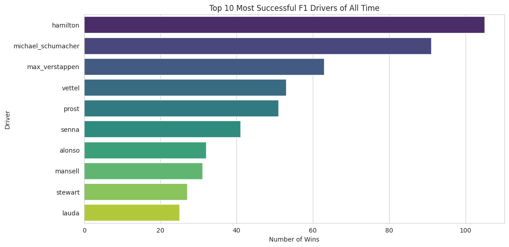
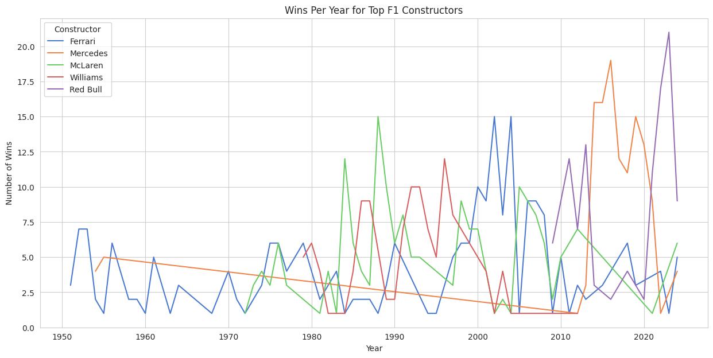
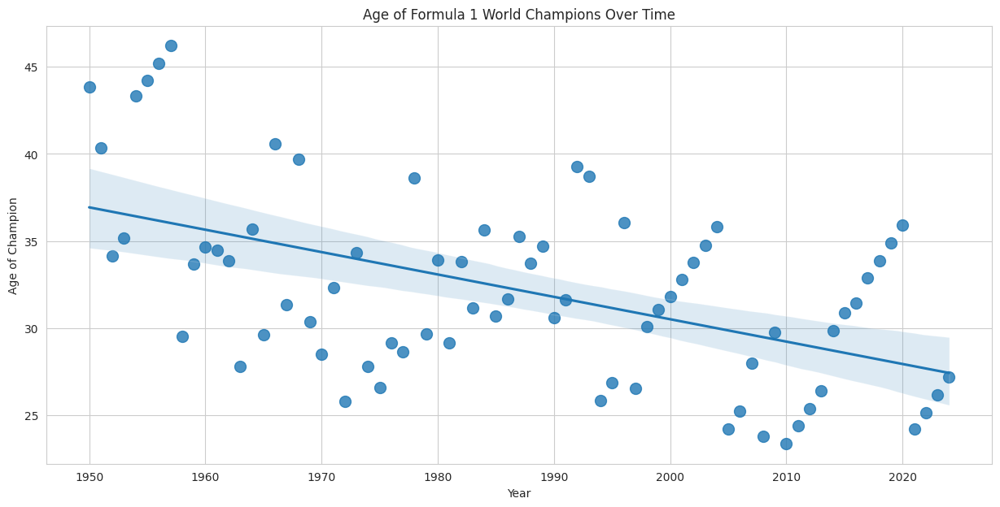

Formula 1 World Championship Analysis (1950-Present)
Project Overview
This project is a comprehensive data analysis of over 70 years of Formula 1 history, from its inaugural season in 1950 to the present day. The goal was to clean, merge, and analyze a rich dataset from Kaggle to uncover trends and insights into the sport's most successful drivers, dominant constructors, and its evolution over time.

This repository contains the Jupyter Notebook with the complete Python code for the analysis and all the visualizations generated.

Technologies Used
Python: The core language used for the analysis.

Pandas: For data manipulation, cleaning, and merging.

NumPy: For numerical operations.

Matplotlib & Seaborn: For creating insightful and presentation-quality visualizations.

Jupyter Notebook: As the interactive environment for developing the analysis.

Key Questions and Visualizations
This analysis sought to answer several key questions about the history of Formula 1. The findings are presented below.

1. Who are the most successful drivers of all time in terms of race wins?

2. Which constructors have dominated different eras of the sport?

3. How has the average age of F1 World Champions changed over the decades?

4. What is the geographical distribution of drivers throughout F1 history?

How to Run This Project
Clone the repository to your local machine.

Ensure you have Python and the required libraries (Pandas, NumPy, Matplotlib, Seaborn) installed.

Open the Jupyter Notebook (F1_Analysis.ipynb) to view and run the analysis.

The data files are included in the /data directory.
